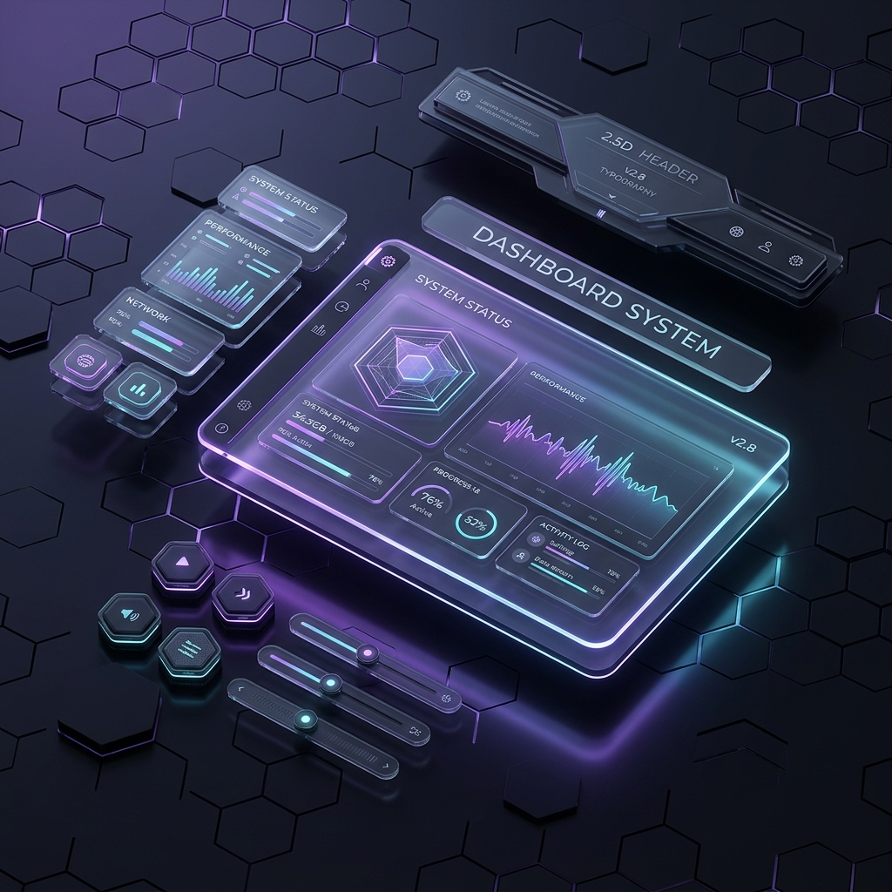

# 🌌 100+ High-Performance 3D Web Elements

### The Ultimate 2.5D Spatial UI Component Library for Modern Web Applications
A massive, production-grade collection of **100 interactive 3D web components** and **UI elements** engineered for a tactile, physical feel. Built with **React**, **Tailwind CSS**, and **Framer Motion**, every component achieves 100% hardware-accelerated 60FPS performance — **zero WebGL required**.

> 🏆 The largest open-source collection of spatial, physics-based web UI elements on GitHub.



[](https://github.com/IntelliSaad/100-3d-web-elements/stargazers)
[](https://github.com/IntelliSaad/100-3d-web-elements/network/members)
[](https://github.com/IntelliSaad/100-3d-web-elements/issues)
[](LICENSE)


---

## 📖 Table of Contents
- [✨ Key Features](#-key-features)
- [🛠️ Tech Stack](#️-tech-stack)
- [📂 Full Component Directory (1–100)](#-full-component-directory-1100)
- [🎨 Design Philosophy](#-design-philosophy)
- [🚀 Quick Start](#-quick-start)
- [❓ FAQ](#-faq)
- [🤝 Contributing](#-contributing)
- [📄 License](#-license)

---

## ✨ Key Features

| Feature | Description |
|---|---|
| 🎯 **100% Tactile** | Every interaction has weight, inertia, and physical momentum via spring physics. |
| ⚡ **Zero WebGL** | Runs entirely on the DOM using `translate3d`, `scale3d`, and `rotate` — locked at 60FPS. |
| 🌈 **Modern Aesthetics** | Glassmorphism, iridescent gradients, procedural noise, and chromatic aberration. |
| 🚀 **ESM Ready** | No build step. Imports React & Framer Motion directly from ESM CDNs. |
| 📦 **Self-Contained** | Each component is a single `.html` file. Copy, paste, and ship. |
| 🖥️ **Laptop Friendly** | Optimized for 8GB RAM machines using `will-change` and GPU compositing. |

---

## 🛠️ Tech Stack


---

## 📂 Full Component Directory (1–100)

### 🔵 Foundational 3D Elements (1–10)
| # | Component | Description |
|---|---|---|
| 01 | [3D Button](components/01-3d-button/) | Physical depth button with shadow layers and press animation. |
| 02 | [Elastic Toggle](components/02-elastic-toggle/) | Squishy ON/OFF switch with spring overshoot. |
| 03 | [Morphing Input](components/03-morphing-input/) | Input field that physically shifts shape on focus. |
| 04 | [Magnetic Card](components/04-magnetic-card/) | Hover-reactive card with 3D tilt tracking. |
| 05 | [Sculpted Progress](components/05-sculpted-progress/) | 3D extruded progress bar with depth shading. |
| 06 | [Notification Block](components/06-notification-block/) | Stacked 3D notification toasts. |
| 07 | [Curved Menu](components/07-curved-menu/) | Radial context menu with arc positioning. |
| 08 | [Pressure Rating](components/08-pressure-rating/) | Star rating with squeeze-pressure physics. |
| 09 | [Product Showcase](components/09-product-showcase/) | 3D product viewer with orbit controls. |
| 10 | [Glassmorphism Shapes](components/10-glassmorphism-shapes/) | Frosted glass geometric primitives. |

### 🟢 Visual Effects & Scenes (11–20)
| # | Component | Description |
|---|---|---|
| 11 | [Cyber Globe](components/11-cyber-globe/) | Rotating wireframe earth with data points. |
| 12 | [Liquid Distortion](components/12-liquid-distortion/) | Mouse-reactive liquid ripple image effect. |
| 13 | [Auth Flip](components/13-auth-flip/) | 3D card flip between login and signup. |
| 14 | [Infinite Tunnel](components/14-infinite-tunnel/) | Procedural infinite depth tunnel. |
| 15 | [Magnetic Buttons](components/15-magnetic-buttons/) | Buttons that magnetically snap to cursor. |
| 16 | [Particle Text](components/16-particle-text/) | Text formed from thousands of particles. |
| 17 | [Carousel Slider](components/17-carousel-slider/) | 3D coverflow-style image carousel. |
| 18 | [Holographic Ticket](components/18-holographic-ticket/) | Prismatic hologram boarding pass. |
| 19 | [Snow](components/19-snow/) | Realistic particle snowfall system. |
| 20 | [Origami Menu](components/20-origami-menu/) | Paper-fold navigation menu. |

### 🟡 Interactive Elements (21–30)
| # | Component | Description |
|---|---|---|
| 21 | [Fluid Aurora](components/21-fluid-aurora/) | Animated aurora borealis background. |
| 22 | [Gooey Cursor](components/22-gooey-cursor/) | SVG filter gooey trail cursor. |
| 23 | [Zen Garden](components/23-zen-garden/) | Interactive CSS zen garden scene. |
| 24 | [Voxel Loader](components/24-voxel-loader/) | 3D voxel-based loading animation. |
| 25 | [Spotlight Reveal](components/25-spotlight-reveal/) | Mouse-following spotlight content reveal. |
| 26 | [Matrix Rain](components/26-matrix-rain/) | Canvas-rendered digital rain. |
| 27 | [Kinetic Typography](components/27-kinetic-typography/) | Animated text with physics. |
| 28 | [Bento Grid](components/28-bento-grid/) | Masonry-style responsive bento layout. |
| 29 | [Interactive Timeline](components/29-interactive-timeline/) | Scroll-driven 3D timeline. |
| 30 | [Morphing Blob](components/30-morphing-blob/) | Organic shape-shifting blob. |

### 🟠 SaaS UI Components (31–40)
| # | Component | Description |
|---|---|---|
| 31 | [Looking Glass](components/31-looking-glass/) | Magnifying lens with depth layers. |
| 32 | [FAQ Accordion](components/32-faq-accordion/) | Clickable 3D expanding FAQ cards. |
| 33 | [Conversion Funnel](components/33-conversion-funnel/) | 3D bar chart conversion visualization. |
| 34 | [Form Tracker](components/34-form-tracker/) | Multi-step checkout flow tracker. |
| 35 | [Architecture Layers](components/35-architecture-layers/) | Exploded 3D tech stack diagram. |
| 36 | [Rolodex Testimonials](components/36-rolodex-testimonials/) | Rotating 3D testimonial cards. |
| 37 | [Blackhole 404](components/37-blackhole-404/) | Gravitational 404 error page. |
| 38 | [Magnetic Navbar](components/38-magnetic-navbar/) | Navigation with magnetic hover physics. |
| 39 | [Cylinder Tabs](components/39-cylinder-tabs/) | Rotating cylindrical tab switcher. |
| 40 | [Ribbon Dropdown](components/40-ribbon-dropdown/) | Unfurling ribbon-style dropdown. |

### 🔴 Advanced Interactions (41–50)
| # | Component | Description |
|---|---|---|
| 41 | [Cryptex Datepicker](components/41-cryptex-datepicker/) | Mechanical rotating date selector. |
| 42 | [Physics Multiselect](components/42-physics-multiselect/) | Tag input with spring collision physics. |
| 43 | [Matrix Grid](components/43-matrix-grid/) | Interactive data matrix visualization. |
| 44 | [Reverse Shell Tunnel](components/44-reverse-shell-tunnel/) | Terminal-style depth tunnel. |
| 45 | [Topographical Map](components/45-topographical-map/) | Contour-line elevation map. |
| 46 | [Fluid Plane](components/46-fluid-plane/) | Deformable mesh surface. |
| 47 | [Mechanical Checkbox](components/47-mechanical-checkbox/) | Industrial lever-style checkbox. |
| 48 | [Add to Cart](components/48-add-to-cart/) | Spatial "throw into cart" animation. |
| 49 | [Social Share](components/49-social-share/) | Expanding radial social buttons. |
| 50 | [Split Flap Search](components/50-split-flap-search/) | Airport departure board search. |

### 🟣 Premium Components (51–60)
| # | Component | Description |
|---|---|---|
| 51 | [Tethered Tooltip](components/51-tethered-tooltip/) | Physically tethered floating tooltip. |
| 52 | [Prism Theme Switcher](components/52-prism-theme-switcher/) | Light/dark mode with prism refraction. |
| 53 | [Spatial Pricing Table](components/53-spatial-pricing-table/) | 3D tiered pricing comparison. |
| 54 | [3D Cookie Drawer](components/54-3d-cookie-drawer/) | Pull-out cookie consent drawer. |
| 55 | [Multi-Select Tag](components/55-multi-select-tag/) | Spring-physics tag input system. |
| 56 | [Spatial Dropzone](components/56-spatial-dropzone/) | 3D file drag-and-drop zone. |
| 57 | [Spatial Comparison](components/57-spatial-comparison/) | Side-by-side comparison matrix. |
| 58 | [Shopping Cart Tracker](components/58-shopping-cart-tracker/) | Physics-based cart badge counter. |
| 59 | [Notification Stacker](components/59-notification-stacker/) | Stacking toast notification system. |
| 60 | [Flip Clock](components/60-flip-clock/) | Mechanical split-flap countdown. |

### ⚫ Spatial Systems (61–70)
| # | Component | Description |
|---|---|---|
| 61 | [Spatial Mega Menu](components/61-spatial-mega-menu/) | Full-width 3D navigation menu. |
| 62 | [Spatial Kanban](components/62-spatial-kanban/) | Drag-and-drop Kanban with depth. |
| 63 | [Broken Link 404](components/63-broken-link-404/) | Shattered glass 404 page. |
| 64 | [Isometric Layers](components/64-isometric-layers/) | Isometric exploded-view layers. |
| 65 | [Mechanical Button](components/65-mechanical-button/) | Industrial press-down button. |
| 66 | [Anatomy Exploder](components/66-anatomy-exploder/) | Component anatomy breakdown. |
| 67 | [Venetian Blinds](components/67-venetian-blinds/) | Page transition with blind-slat effect. |
| 68 | [Mail Slot Newsletter](components/68-mail-slot-newsletter/) | Physical mail-slot email signup. |
| 69 | [Holographic Testimonial](components/69-holographic-testimonial/) | Rainbow-reflective review cards. |
| 70 | [Spatial Bento Grid](components/70-spatial-bento-grid/) | Layout-morphing interactive bento. |

### 🔷 2.5D Spatial UI (71–80)
| # | Component | Description |
|---|---|---|
| 71 | [Morphing Dropdown](components/71-morphing-dropdown/) | Fluid navigation dropdown system. |
| 72 | [Spatial Context Menu](components/72-spatial-context-menu/) | Right-click 3D context menu. |
| 73 | [Isometric Conveyor](components/73-isometric-conveyor/) | Animated isometric conveyor belt. |
| 74 | [Command Palette ⌘K](components/74-command-palette/) | Global search with gliding highlights. |
| 75 | [Empty State Box](components/75-empty-state-box/) | "Lost in Space" immersive empty state. |
| 76 | [Spatial Table Row](components/76-spatial-table-row/) | Inline row expansion with background recession. |
| 77 | [Morphing Pill Navbar](components/77-morphing-pill-navbar/) | Scroll-triggered glassmorphic pill nav. |
| 78 | [Gliding Tabs](components/78-gliding-tabs/) | Holographic app dock with gliding highlight. |
| 79 | [AI Neural Input](components/79-floating-label-input/) | Conic-gradient input with star particles. |
| 80 | [Fluid Mesh Gradient](components/80-fluid-mesh-gradient/) | Iridescent liquid silk background. |

### 🛸 Immersive Backgrounds & Physics (81–90)
| # | Component | Description |
|---|---|---|
| 81 | [Cyber-Grid Background](components/81-cyber-grid-background/) | Topographical gravity-well canvas grid. |
| 82 | [Smooth Scroll Wrapper](components/82-smooth-scroll-wrapper/) | Inertia-based scroll hijack with springs. |
| 83 | [Parallax Depth Map](components/83-parallax-depth-map/) | Multi-layered Z-index depth diorama. |
| 84 | [Magnetic Blend Cursor](components/84-magnetic-blend-cursor/) | Velocity-driven stretch & squash cursor. |
| 85 | [Liquid Page Transition](components/85-liquid-page-transition/) | Route-based occlusion transitions. |
| 86 | [Velocity Skew Grid](components/86-velocity-skew-grid/) | Scroll-momentum image skewing. |
| 87 | [Push-Reveal Footer](components/87-push-reveal-footer/) | Fixed footer curtain reveal. |
| 88 | [Dynamic Island CTA](components/88-peeking-cta/) | Velocity-driven morphing toolbar. |
| 89 | [Spy Nav Headers](components/89-stacking-headers/) | Intersection-observer sidebar nav. |
| 90 | [Spotlight Tracking Grid](components/90-svg-scroll-border/) | Mouse-tracking illumination grid. |

### 🌌 Kinetic & Ambient Systems (91–100)
| # | Component | Description |
|---|---|---|
| 91 | [Scroll Unveil Typography](components/91-scrubbable-scroll-text/) | Kinetic text-slice scroll reveal. |
| 92 | [Split-Text Stagger](components/92-split-text-reveal/) | Kinetic typography entrance. |
| 93 | [Smartphone App Showcase](components/93-horizontal-scroll-hijack/) | Vertical scrollytelling phone tour. |
| 94 | [Liquid Circular HUD](components/94-sticky-mask-reveal/) | Radial clip-path overlay menu. |
| 95 | [Blur-Up Image Loader](components/95-blur-up-image/) | Progressive loading with blur-up. |
| 96 | [Aurora Mesh + Noise](components/96-aurora-mesh-noise/) | Procedural aurora with SVG film grain. |
| 97 | [Prismatic Volumetric Beams](components/97-prismatic-volumetric-beams/) | Hardware-accelerated light rays. |
| 98 | [Architectural Blueprint](components/98-architectural-blueprint/) | Dynamic measurement guide lines. |
| 99 | [Obsidian Glow Surface](components/99-obsidian-glow-surface/) | Frosted glass with reactive magma core. |
| 100 | [Grainy Analog Shadows](components/100-grainy-analog/) | Lo-fi noise with heavy lagging shadows. |

---

## 🎨 Design Philosophy: "Physical Intent"

Every component exists in a simulated **3D space**. We reject flat, lifeless UIs.

| Principle | Implementation |
|---|---|
| **Z-Axis Depth** | Elements cast physical shadows and have architectural height via `translateZ`. |
| **Spring Physics** | No linear tweens. We define how objects move with `stiffness`, `damping`, and `mass`. |
| **Optical Refraction** | Simulated glass and light using `backdrop-filter` and `mix-blend-mode`. |
| **GPU Compositing** | 100% `transform: translate3d()` animations bypass the CPU entirely. |

---

## 🚀 Quick Start

### 1. Clone & Serve
```bash
git clone https://github.com/IntelliSaad/100-3d-web-elements.git
cd 100-3d-web-elements
npx -y live-server --port=8080
```

### 2. Use a Component
All components are **self-contained**. Copy any `.html` file into your project — all dependencies (React, Tailwind, Framer Motion) are loaded via CDN. Zero configuration required.

```
📁 components/
└── 84-magnetic-blend-cursor/
    └── cursor.html      ← Just open this file!
```

---

## ❓ FAQ

### What is a "2.5D Spatial UI"?
It's a design approach that uses CSS 3D transforms (`translateZ`, `rotateX`, `perspective`) to create depth and physicality in standard DOM elements — without needing WebGL or Three.js.

### Can I use these in my React/Next.js project?
Yes! Each component's React logic can be extracted and used directly. The inline CDN imports can be replaced with your project's npm packages.

### Will these run on low-end machines?
Yes. Every animation uses `will-change: transform` and `translate3d()` to force GPU compositing, achieving a locked 60FPS even on 8GB RAM laptops.

### Do I need a build step?
No. Every component loads React, Tailwind, and Framer Motion from ESM CDNs. Just open the `.html` file in a browser.

---

## 🤝 Contributing

Contributions are welcome! See [CONTRIBUTING.md](CONTRIBUTING.md) for guidelines.

---

## 📄 License

Distributed under the **MIT License**. See [`LICENSE`](LICENSE) for more information.

---

<p align="center">
  <strong>Engineered with physical intent by <a href="https://github.com/IntelliSaad">Muhammad Saad Ullah</a></strong>
  <br>
  <em>If this library helped you, consider giving it a ⭐</em>
</p>
